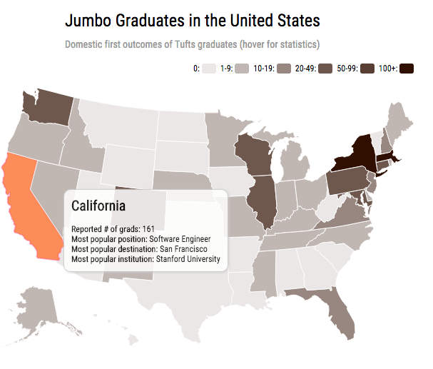
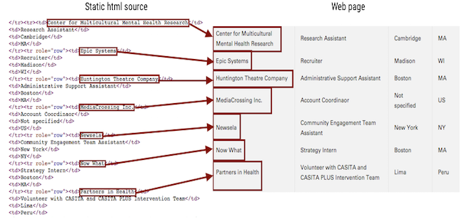
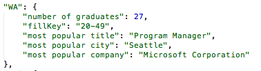

#IDHack 2016 Demo ![Brought to you by Tufts Enigma][logo]
[logo]: imgs/logo.png
## Visualizing Tufts Graduate Outcomes    
   


Greetings hackers! In this technical demo, we're going to show you how to create a map visualization - from web mining to data processing to visualization - using a bunch of different tools.

If you're somewhere in the **beginner** to **intermediate** skill level for Python, and Javascript (ideally both, but one or the other is fine too), then you'll probably get the most of this demo. If not, our code / this document is still worth a skim!

Here are some technical concepts that we touch on in this demo:

1.	creating a simple web scraping script (**Python**)
2.	basic data parsing / processing (**Python**)
3.	creating an interactive data visualization (**Javascript**) 

The final product will look something like:



## Context

In 2015, The Tufts Independent Data Journal wrote an article that looked to answer a simple question using data - [where do Tufts graduates mostly end up?](http://tuftsenigma.org/where-exactly-do-tufts-graduates-go/) Like anyone who ever asks an interesting question, we decided to do a little research. With a little noodlin' and googlin', we quickly found out that Tufts Career Center itself posts graduate outcomes right on its [website](http://students.tufts.edu/career-center/explore-careers-and-majors/outcomes-major)!


So we have our data. Let's make something with it.

## Setup

Before we dive in, here's a rundown of some of the technical tools in this demo and how to get them set up:

* **Python (v2.7)** - the main programming language we will be using to work with our data.

* **[Requests](http://docs.python-requests.org/en/master/) (v3.2.1)** - easily make HTTP requests in Python. Download this package using [pip](https://pypi.python.org/pypi/pip):

	```pip install requests==2.9.1```

* **[BeautifulSoup](http://www.crummy.com/software/BeautifulSoup/) (v3.2.1)** - a web / text scraping package in Python that we'll use to parse the careers page; most easily installed using pip:

	```pip install BeautifulSoup==3.2.1```

* **[Pandas](http://pandas.pydata.org/) (v0.16.2)** - a data analysis package in Python allowing for easy manipulation, querying, and reformatting of our parsed data; again, most easily installed using pip:

	```pip install Pandas==0.16.2```

* **[D3.js](https://d3js.org/) (v3.5.3)** - *another* data manipulation package in javascript, primarily used for creating interactive web visualizations; we'll be using this to make our final map visualization. D3 uses the following script tag (we'll go over where to put that eventually):

	```<script src="//cdnjs.cloudflare.com/ajax/libs/d3/3.5.3/d3.min.js"></script>```

* **[TopoJSON.js](https://github.com/mbostock/topojson) (v1.6.9)** - a javascript library that encodes topology (don't worry about what that means); we'll use this as a helper script in our map visualization. TopoJSON uses the following script tag:

	```<script src="//cdnjs.cloudflare.com/ajax/libs/topojson/1.6.9/topojson.min.js"></script>```

* **[DataMaps.js](http://datamaps.github.io/)** - the final javascript library we'll be using to conveniently generate our actual map. This one you'll need to download and place in your project directory:

	```https://raw.githubusercontent.com/markmarkoh/datamaps/master/dist/datamaps.usa.min.js``` 

It's worth glancing at the docs for each of these packages, but by no means do you need to be a pro at any of these tools for this tutorial.

Ready to go?

## Web Scraping with BeautifulSoup

The first thing we want to do is *scrape* all the data from the page. Luckily for us, the source code for the website is nicely formatted in a static html table. On inspection, each row corresponds to a job entry:



We'll write a script called `parse_career_page.py` that will hit this url and output a nicely formatted .csv file with all this jobs data.

Using BeautifulSoup, we can pretty easily extract the entries from these tables and throw them into a **Pandas dataframe**. The fields we care about from each entry in the table are *company*, *title*, *city*, and *state* - so we initialize our dataframe with these columns:

``` df = pd.DataFrame([], columns=["company", "title", "city", "state"])```

In one line, we can make a request to the career page url to get a response with the html source:

``` html = requests.get(url).content```

And in the next line, we can create a 'soup' of all the parsed html elements in the page (including tables):

``` soup = bs.BeautifulSoup(html)```

We can then search for tables in our 'soup' and extract all the rows that correspond to job entries:

```job_entries = list(soup.findAll("tr"))```

Then we want to append each of these entries to our dataframe (check out the script to see how this is done). To save our dataframe to a .csv file, it's yet another simple one-liner:

``` df.to_csv("raw_jobs_data.csv") ```

Check out the .csv file - each row should look something like:

``` 0,Eastdil Secured,Analyst,New York,NY ```

## Data Cleaning / Processing with Pandas

There are around 2000 rows of job entries in our csv file! Before we can throw this data onto a map, we want to *summarize* the data and *format* it to fit the expected input format for the **DataMaps API**. Now, we *could* just take our raw .csv data and write a javascript to reformat it 'real-time' *on* our web page, but we'd rather not have our web page work that hard. Instead, we're going to let Python do the heavy lifting just once and produce a clean .json file to directly plug into our web page.

So in this step, we're going to write another Python script called `get_stats.py` that's going to calculate some basic summary statistics about our data that we can then visualize. Primarily, we want to know **what the most common institution, job title, and city is for Tufts graduates in each U.S. state**.

We're again going to use a Pandas dataframe to do all our data manipulation. First things first, we import our .csv file into a dataframe:

```python
df = pd.read_csv("raw_jobs_data.csv")
```

Then the *key* line of code in this script are getting these summary statistics for each state, which we can do by **filtering by state** and then **getting the mode value of each column**. This looks like:

``` MA_stats = df[df["state"] == "MA"].mode() ```

Populating a Python dictionary with our data, we then dump it to a .json file which is the following line at the end of our function:

``` json.dump(domestic_stats, output_file, indent=4) ```

So now, a nicely formatted state-by-state summary of our data can be found in ```final_jobs_data.json```. Here's the entry for Washington:



Looks like Jumbos are doing alright out there!


## Visualizing with d3.js

*Finally*, we're at a place where we can create our map!


